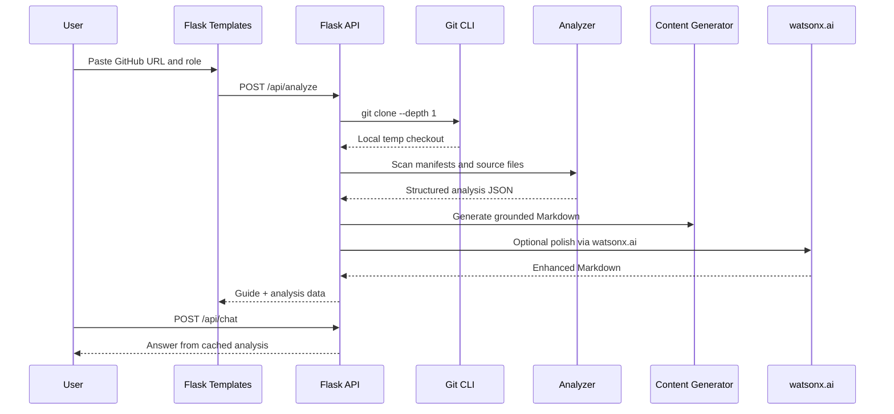

# SmartOnboard Architecture

SmartOnboard is a Flask web app that turns a public GitHub repository into a role-specific onboarding guide.

## Runtime Flow

## Components

### Flask App

File: `app.py`

Responsibilities:

- Serves landing page and dashboard.
- Exposes `/api/health`, `/api/analyze`, `/api/chat`, and `/api/export/<format>`.
- Loads `.env` from the project directory.
- Keeps analysis results in an in-memory cache for the current process.
- Cleans cloned repositories after analysis.

### Repository Analyzer

File: `core/analyzer_real.py`

Responsibilities:

- Validates public GitHub URLs.
- Runs a real shallow `git clone`.
- Scans up to `MAX_ANALYZED_FILES` files.
- Ignores dependency/build/cache folders.
- Detects languages from extensions.
- Parses common manifests:
  - `package.json`
  - `requirements.txt`
  - `pyproject.toml`
  - `go.mod`
  - `Cargo.toml`
  - `Dockerfile`
- Identifies entry points, test files, config files, top-level directories, and key files.
- Extracts short snippets from important files for guide generation.

### Content Generator

File: `core/content_generator.py`

Responsibilities:

- Builds a deterministic Markdown guide from real analysis data.
- Creates role-specific views for engineers, managers, and architects.
- Includes a Mermaid architecture diagram.
- Produces setup commands, testing notes, risks, and first contribution guidance.

### watsonx.ai Enhancer

File: `core/watsonx_enhancer_real.py`

Responsibilities:

- Uses the IBM watsonx.ai SDK when available.
- Falls back to the official watsonx REST API through `requests`.
- Keeps the app usable if watsonx is unavailable by returning the deterministic guide.
- Reports configuration and runtime availability through `/api/health`.

### Frontend

Files:

- `templates/base.html`
- `templates/index.html`
- `templates/dashboard.html`
- `templates/export.html`

Responsibilities:

- Accepts repository URL and role.
- Calls the analysis API.
- Renders Markdown through Marked.js.
- Renders Mermaid diagrams.
- Supports chat and exports.

### Bob Assets

Files:

- `.bob/modes/onboarding-guide-generator.yaml`
- `.bob/skills/onboarding-guide.md`

Responsibilities:

- Provide reusable Bob IDE workflow evidence.
- Capture the intended custom mode persona and analysis steps.
- Support context mentions like `@file` and `@folder` inside Bob IDE.

## Data Model

`/api/analyze` returns:

- `repo_url`
- `repo_name`
- `role`
- `tech_stack`
- `structure`
- `key_files`
- `analysis`
- `content`
- `analysis_time`
- `watsonx`

The full `analysis` object is cached and reused by `/api/chat`.

## Security Notes

- `.env` is ignored by git.
- The app only accepts `https://github.com/<owner>/<repo>` URLs.
- Repositories are cloned into temporary directories and removed after analysis.
- Export files are written to the system temp directory.
- Do not use Flask's development server for production deployment.

## Current MVP Limits

- Cache is in-memory and clears when the process restarts.
- Only public GitHub repositories are supported.
- Analysis is synchronous.
- The scanner caps files for demo speed.
- Bob IDE execution is represented by the included mode/skill assets; the web app performs its own local analysis and watsonx enhancement.

