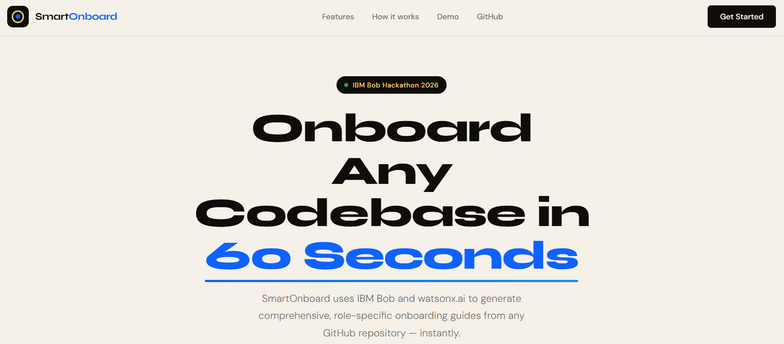
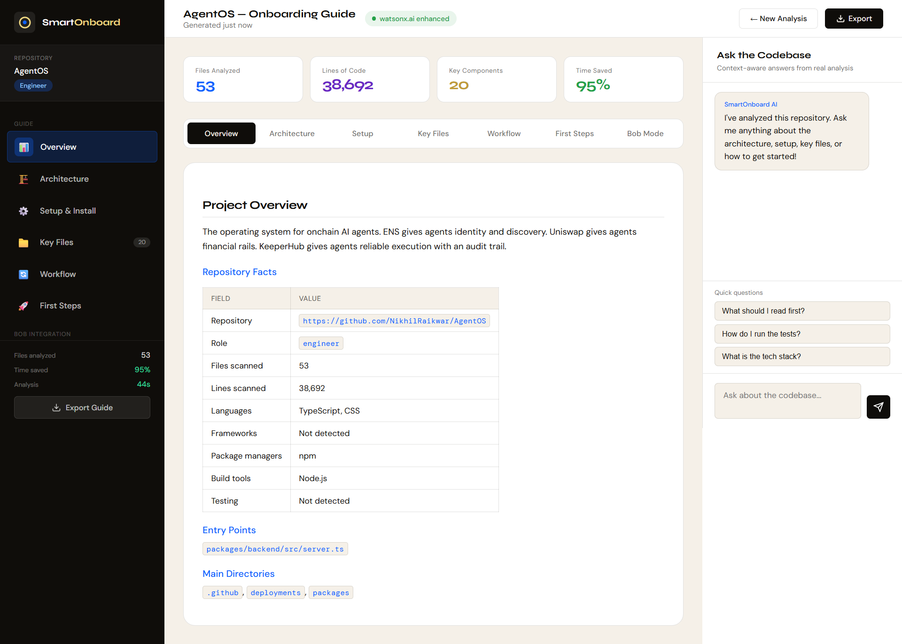

# SmartOnboard

AI-powered codebase onboarding accelerator built for the [IBM Bob Hackathon](https://lablab.ai/ai-hackathons/ibm-bob-hackathon).

[](https://bob.ibm.com)
[](https://www.ibm.com/watsonx)
[](https://flask.palletsprojects.com)
[](https://mermaid.js.org)
[](LICENSE)



## What It Does

SmartOnboard turns a public GitHub repository into a role-specific onboarding guide for new team members.

Paste a repo URL, choose a role, and SmartOnboard:

- Clones the real repository with `git clone --depth 1`.
- Scans real files, manifests, tests, configs, entry points, and directory structure.
- Generates a practical onboarding guide with architecture, key files, setup, workflow, risk areas, and first steps.
- Adds an interactive Q&A panel backed by the repository analysis.
- Exports the result as HTML, Markdown, or Bob Skill-style Markdown.
- Includes reusable IBM Bob mode and skill assets for repeatable team workflows.



## Why This Fits The IBM Bob Hackathon

The IBM Bob Hackathon challenge is to build developer workflows that help teams move faster with an AI development partner that understands real codebases. SmartOnboard targets one of the most common developer productivity bottlenecks: onboarding onto unfamiliar repositories.

New engineers often spend 2-4 weeks reading code, asking repeated questions, and piecing together architecture from scattered documentation. SmartOnboard compresses that ramp-up into a guided, repo-aware workflow.

IBM Bob is central to the project:

- Bob was used as the development partner for planning, implementation, debugging, UI iteration, and documentation.
- The repo includes exported Bob session evidence in `bob_sessions/`.
- The repo includes a reusable Bob custom mode: `.bob/modes/onboarding-guide-generator.yaml`.
- The repo includes a reusable Bob skill: `.bob/skills/onboarding-guide.md`.
- The product itself is designed around Bob-style full repository context, code explanation, context mentions, and literate onboarding documentation.

## Demo Flow

1. Open the app.
2. Paste a public GitHub repository URL.
3. Choose a role: Engineer, Manager, or Architect.
4. Generate the onboarding guide.
5. Review Overview, Architecture, Setup, Key Files, Workflow, and First Steps.
6. Ask follow-up questions in the codebase chat.
7. Export the guide as HTML, Markdown, or Bob Skill format.

## Core Features

### Real Repository Analysis

SmartOnboard does not return hardcoded demo content. It clones and scans the submitted repository, then derives:

- primary languages
- package managers
- framework signals
- build tools
- config files
- test files
- entry points
- key files
- setup commands
- risk areas

### Role-Specific Guides

- **Engineer**: setup, test commands, code paths, first PR guidance
- **Manager**: project shape, risk areas, maintenance signals
- **Architect**: system structure, entry points, configuration, runtime flow

### Interactive Q&A

The dashboard chat answers questions from the cached analysis. It is designed for common onboarding questions:

- What should I read first?
- How do I run the tests?
- What is the tech stack?
- Where is the main logic?
- What are the risk areas?

### Exportable Output

Guides can be exported as:

- HTML for sharing with new hires
- Markdown for GitHub/wiki docs
- Bob Skill-style Markdown for repeatable onboarding workflows

## Architecture

```text
Browser UI
  |
  |-- POST /api/analyze
  |-- POST /api/chat
  |-- POST /api/export/{format}
  v
Flask App
  |
  |-- RepositoryAnalyzer
  |     |-- validates GitHub URL
  |     |-- clones public repo
  |     |-- scans files and manifests
  |
  |-- ContentGenerator
  |     |-- builds grounded onboarding markdown
  |
  |-- WatsonxEnhancer
        |-- optionally polishes guide and Q&A
        |-- falls back safely if credentials/API fail
```

## Tech Stack

- Python Flask
- Vanilla HTML, CSS, and JavaScript
- Mermaid.js for diagrams
- Marked.js for Markdown rendering
- IBM watsonx.ai REST/SDK adapter
- IBM Bob custom mode and skill assets
- Vercel Python serverless entrypoint

## Project Structure

```text
smartonboard/
  app.py
  api/index.py
  vercel.json
  requirements.txt
  .env.example
  .bob/
    modes/onboarding-guide-generator.yaml
    skills/onboarding-guide.md
  core/
    analyzer_real.py
    content_generator.py
    watsonx_enhancer_real.py
  templates/
    index.html
    dashboard.html
    analyzing.html
    export.html
    base.html
  docs/images/
    banner.png
    dashboard.png
    form.png
    exported-html-guide.png
  bob_sessions/
    README.md
    bob_task_may-15-2026_11-59-53-pm.md
    screenshots/
      task_consumption_may_15.png
      bob_bobalytics_usage.png
  ARCHITECTURE.md
  API.md
  SETUP.md
  DEMO_SCRIPT.md
  SUBMISSION_CHECKLIST.md
```

## Quick Start

```bash
cd smartonboard
python -m venv .venv
.venv\Scripts\activate
pip install -r requirements.txt
copy .env.example .env
python app.py
```

Open:

```text
http://localhost:5000
```

Health check:

```bash
curl http://localhost:5000/api/health
```

## Environment Variables

watsonx.ai is optional. Without watsonx credentials, SmartOnboard still generates a grounded guide from the real repository scan.

```env
WATSONX_API_KEY=your_watsonx_api_key
WATSONX_PROJECT_ID=your_watsonx_project_id
WATSONX_URL=https://us-south.ml.cloud.ibm.com
WATSONX_MODEL_ID=meta-llama/llama-3-3-70b-instruct
SECRET_KEY=replace_with_random_secret
MAX_REPO_SIZE_MB=100
MAX_ANALYZED_FILES=250
FLASK_DEBUG=false
```

## Deploy On Vercel

This repo includes `api/index.py` and `vercel.json` for Vercel's Python serverless runtime.

1. Import `https://github.com/NikhilRaikwar/SmartOnBoard` into Vercel.
2. Framework preset: **Other**.
3. Build command: leave empty.
4. Output directory: leave empty.
5. Add the environment variables listed above.
6. Deploy and test `/api/health`.

Vercel serverless functions have execution time limits. For the demo, use small-to-medium repositories such as `https://github.com/sindresorhus/is`. For large repositories, deploy the same Flask app to a long-running service such as Render, Railway, Fly.io, or IBM Cloud.

## IBM Bob Evidence

Hackathon submissions must clearly demonstrate meaningful IBM Bob usage. This repo includes:

- `bob_sessions/bob_task_may-15-2026_11-59-53-pm.md`
- `bob_sessions/screenshots/task_consumption_may_15.png`
- `bob_sessions/screenshots/bob_bobalytics_usage.png`
- `.bob/modes/onboarding-guide-generator.yaml`
- `.bob/skills/onboarding-guide.md`

See `bob_sessions/README.md` for evidence organization and screenshot guidance.

## Hackathon Submission Alignment

Based on the official IBM Bob Hackathon page, submissions are judged on application of technology, presentation, business value, and originality. SmartOnboard is built around those criteria:

- **Application of Technology**: real Bob-assisted development evidence, custom Bob mode, reusable Bob skill, repo-context workflow, optional watsonx.ai enhancement.
- **Presentation**: polished dashboard, exportable HTML guides, demo script, screenshots, and clear documentation.
- **Business Value**: reduces onboarding time for new developers and repeated explanation work for senior engineers.
- **Originality**: turns Bob's repo understanding into a reusable onboarding accelerator instead of a one-off chat prompt.

## API

See [API.md](API.md).

## Additional Docs

- [ARCHITECTURE.md](ARCHITECTURE.md)
- [SETUP.md](SETUP.md)
- [DEMO_SCRIPT.md](DEMO_SCRIPT.md)
- [SUBMISSION_CHECKLIST.md](SUBMISSION_CHECKLIST.md)
- [BOB_IDE_QUICKSTART.md](BOB_IDE_QUICKSTART.md)

## License

MIT. See [LICENSE](LICENSE).
